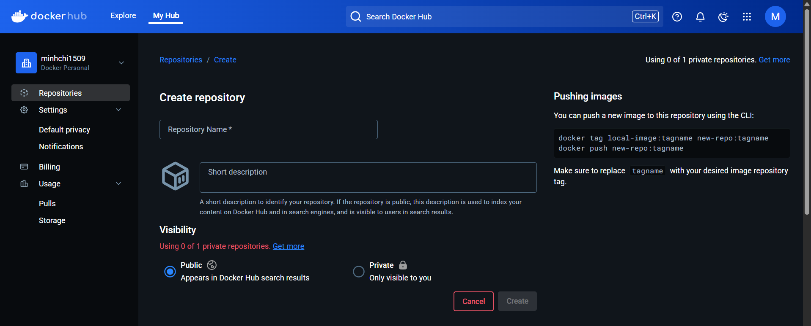

# Images

## 1. Docker Image là gì?

**Docker Image** là một **template chỉ đọc** chứa mã nguồn, thư viện, môi trường runtime, biến môi trường, và tất cả những gì cần thiết để chạy ứng dụng.

- Ta có thể hiểu image giống như một "bản snapshot" của một hệ thống thu nhỏ.
- Một image có thể tạo ra nhiều **container**.

📦 Ví dụ: Image `node:18-alpine` là một phiên bản Node.js nhẹ, dựa trên Alpine Linux.

## 2. Làm việc với Docker Image từ Docker Hub

### 📥 Pull một image từ Docker Hub

```bash
docker pull nginx
docker pull node:18-alpine
```

### 📃 Xem danh sách image đã tải về

```bash
docker images -a
```

### ❌ Xóa một image

```bash
docker rmi <IMAGE_NAME_OR_ID>
```

## 3. Tạo Docker Image với Dockerfile

Để tạo image tùy chỉnh, ta cần tạo một **Dockerfile** — một tập tin hướng dẫn Docker cách build image.

### 📝 Ví dụ: Dockerfile đơn giản cho Node.js app

```Dockerfile
# Base image
FROM node:18-alpine

# Thư mục làm việc trong container
WORKDIR /app

# Copy file vào container
COPY package*.json ./

# Cài đặt dependencies
RUN npm install

# Copy toàn bộ project
COPY . .

# Expose port
EXPOSE 3000

# Lệnh khởi chạy
CMD ["node", "index.js"]
```

### ⚙️ Build image từ Dockerfile

```bash
docker build -t my-node-app .
```

:::tip[Xem thêm]

- Xem thêm về **Dockerfile**: [tại đây](./reference/docker-file)
- Xem thêm về cấu trúc, options của câu lệnh `docker build`: [tại đây](./reference/cli/docker-build)

:::

## 4. Gán tag và đẩy image lên Docker Hub

### 🔧 Đăng nhập Docker Hub

```bash
docker login -u <USER_NAME> -p <PASSWORD>
```

### 📭 Tạo repository trên Docker Hub



### 📦 Gán tag cho image

- Cú pháp:

```bash
docker tag <image-name> <dockerhub-username>/<repo-name>:<tag>
```

- Ví dụ: Giả sử ta đã có một image cục bộ tên là `my-app`, ID là `abc123456789`.

```bash
docker tag my-app minhchi1509/my-app:latest
```

- Giải thích:
  - `minhchi1509` là username Docker Hub
  - `my-app` là tên repository ta muốn tạo/truy cập trên Docker Hub
  - `latest` là tag (có thể thay bằng `v1`, `1.0.0`, v.v.)

### 🚀 Push image lên Docker Hub

- Cuối cùng, đẩy image lên Docker Hub bằng lệnh:

```bash
docker push <dockerhub-username>/<repo-name>:<tag>
```

## 5. Các câu lệnh CLI để quản lý image

| Lệnh                                      | Mô tả                                                                |
| ----------------------------------------- | -------------------------------------------------------------------- |
| `docker image prune -af`                  | Xóa hết tất cả các images không được gán vào container đang chạy nào |
| `docker pull NAME[:TAG]`                  | Pull một image từ docker hub về                                      |
| `docker rmi -f <...image_id \| name:tag>` | Xóa 1 hoặc nhiều image theo ID hoặc theo `name:tag`                  |

### docker images

- Dùng để liệt kê các images đang có

```bash
# Liệt kê tất cả các images
docker images -a
```

- Để liệt kê các images theo tên và tag, ta sử dụng

```bash
docker images -a [REPOSITORY[:TAG]]

# Ví dụ, liệt kê tất cả các images liên quan đến java
docker images -a java

REPOSITORY          TAG                 IMAGE ID            CREATED             SIZE
java                8                   308e519aac60        6 days ago          824.5 MB
java                7                   493d82594c15        3 months ago        656.3 MB
java                latest              2711b1d6f3aa        5 months ago        603.9 MB
```
